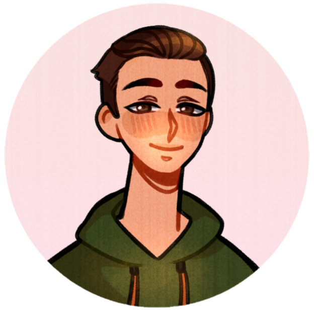

[![LinkedIn][linkedin-shield]][linkedin-url]

<!-- PROJECT LOGO -->

  <h3 align="center">Personal Website</h3>

  

    My personal website built using React, TailwindCSS, and EmailJS.
     
    <a href="https://evanchernicky.com/"><strong>View Deployment »</strong></a>
  

<!-- TABLE OF CONTENTS -->

  
Table of Contents

  <ol>
    <li>
    <a href="#about-the-project">About The Project</a>
      <ul>
        <li><a href="#built-with">Built With</a></li>
      </ul>
    </li>
    <li><a href="#roadmap">Future Updates</a></li>
    <li><a href="#contact">Contact</a></li>
    <li><a href="#acknowledgments">Acknowledgments</a></li>
  </ol>

<!-- ABOUT THE PROJECT -->
## About The Project

[![Personal Website Screen Shot][product-screenshot]](https://evanchernicky.com/)

Created and designed personal website.

HoboTracks Features:
* Light and dark modes which defaults to user preferences. Ability to toggle on and off.
* Custom CSS animations which are triggered using the Intersection Observer API.
* Contact form integrated with EmailJS
* Fully responsive on desktop, tablet, and mobile devices.

(<a href="#top">back to top</a>)

## Built With

* [React.js](https://reactjs.org/)
* [Tailwind CSS](https://tailwindcss.com/)
* [EmailJS](https://www.emailjs.com/)

(<a href="#top">back to top</a>)

<!-- FUTURE UPDATES -->
## Future Updates

- [ ] About Section
- [ ] Additional Project Details with GIFs

(<a href="#top">back to top</a>)

<!-- CONTACT -->
## Contact

Evan Chernicky
* [Personal Website](https://evanchernicky.com/)
* [LinkedIn](https://www.linkedin.com/in/echernicky/)
* [Medium](https://medium.com/@echernicky)
* [Email](echernicky@gmail.com)

Deployment Link: [https://evanchernicky.com/](https://evanchernicky.com/)

(<a href="#top">back to top</a>)

<!-- ACKNOWLEDGMENTS -->
## Acknowledgments

* [MDN Web Docs - Intersection Observer API](https://developer.mozilla.org/en-US/docs/Web/API/Intersection_Observer_API)
* [Learn Intersection Observer In 15 Minutes](https://www.youtube.com/watch?v=2IbRtjez6ag)

(<a href="#top">back to top</a>)

<!-- MARKDOWN LINKS & IMAGES -->
<!-- https://www.markdownguide.org/basic-syntax/#reference-style-links -->
[linkedin-url]: https://www.linkedin.com/in/echernicky/
[product-screenshot]: src/assets/projects/personal-website.png
[linkedin-shield]: https://img.shields.io/badge/-LinkedIn-black.svg?style=for-the-badge&logo=linkedin&colorB=555
